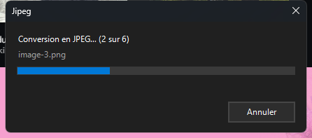

# Jipeg

Convertir une image en JPEG par **clic droit**, avec l'encodeur [jpegli](https://github.com/google/jpegli)
de Google : même qualité visuelle qu'un JPEG classique, fichier nettement plus petit, et le
résultat reste un `.jpg` lisible partout.

Pas d'application à ouvrir, pas de réglages : une entrée dans le menu contextuel, une petite
fenêtre de progression aux couleurs de Windows, et c'est fini.



## Installation

1. Télécharger le dépôt (**Code → Download ZIP**) et décompresser.
2. Double-cliquer sur **`Installer.bat`**.
3. Cliquer sur **Installer**.

Aucun droit administrateur. Tout reste dans le profil utilisateur.

Sous Windows 11, laisser la case cochée : sinon l'entrée n'apparaît que sous
**Afficher plus d'options** (ou Maj + F10). Cocher la case restaure le menu contextuel
classique et redémarre brièvement l'Explorateur.

## Utilisation

Clic droit sur une image → **Convertir en JPEG (Jipeg)**.

- Fonctionne sur une **sélection multiple** : une seule fenêtre traite tout le lot.
- Clic droit sur un **dossier** : reprend toutes les images qu'il contient.
- Le fichier d'origine n'est **jamais** modifié ni supprimé. Le résultat est écrit à côté,
  suffixé `_jipeg` (`photo.png` → `photo_jipeg.jpg`).
- Qualité fixée à **90** (échelle libjpeg) — le bon compromis par défaut.

La fenêtre affiche la progression, puis le bilan (`4,7 Mo → 359 Ko  (−93 %)`) et se ferme
seule. En cas d'échec sur un fichier, elle reste ouverte pour que le message soit lisible.

## Formats acceptés

PNG, APNG, JPEG, GIF, JXL, PPM/PNM/PGM/PAM/PFM en direct ;
BMP, TIFF, ICO via une conversion intermédiaire automatique.

Le WebP n'est pas pris en charge — `cjpegli` ne sait pas le lire.

## Bon à savoir

- **Ré-encoder un JPEG déjà compressé peut l'agrandir.** jpegli brille sur des sources non
  compressées (PNG, TIFF) ou des JPEG de haute qualité. Si le résultat est plus gros, le
  bilan l'indique avec un `+` : le chiffre affiché est toujours le vrai.
- Les métadonnées (EXIF, profil ICC) ne sont pas recopiées par `cjpegli`.
- Les fichiers sont encodés un par un ; la fenêtre reste réactive et le bouton **Annuler**
  arrête le lot après le fichier en cours.

## Désinstallation

**`Desinstaller.bat`**, ou *Paramètres → Applications installées → Jipeg*.

Retire l'entrée du clic droit, le dossier d'installation et — seulement si l'installeur
l'avait activé — le réglage du menu contextuel classique. Les images converties ne sont
pas touchées.

## Détails techniques

| | |
|---|---|
| Installé dans | `%LOCALAPPDATA%\Jipeg` |
| Clés de registre | `HKCU\Software\Classes\SystemFileAssociations\<ext>\shell\JipegConvert` et `HKCU\Software\Classes\Directory\shell\JipegConvert` |
| Encodeur | `cjpegli.exe` de **libjxl v0.11.1** — dernière version publiant ce binaire (v0.12 l'a retiré, et `google/jpegli` ne publie aucun binaire) |
| SHA-256 du binaire | `db564007b69b8f038eb4703fc72278c15a992aad9865fa59166735d6fd41b740` |
| Interface | PowerShell 5.1 + WinForms, contrôles Windows standards, thème clair/sombre suivi automatiquement |

Le binaire est inclus dans le dépôt pour que le ZIP soit directement installable. S'il est
absent, l'installeur télécharge l'archive officielle libjxl v0.11.1 depuis GitHub et
**vérifie son empreinte SHA-256** avant d'en extraire `cjpegli.exe`.

### Sélection multiple

L'Explorateur lance un processus par fichier sélectionné. La première instance garde un
verrou pendant toute sa durée de vie ; les suivantes déposent leurs chemins dans une file
et rendent la main. L'instance vivante les récupère, y compris après la fin du lot (elle
repart alors), et si quelque chose arrive pile au moment de la fermeture, elle relance une
instance pour ces fichiers plutôt que de les perdre.

## Contenu

```
Installer.bat            lance l'installation
Desinstaller.bat         lance la désinstallation
bin/cjpegli.exe          l'encodeur jpegli (+ licences des composants)
src/Install-Jipeg.ps1    installeur (fenêtre, ou -Silent pour un déploiement)
src/Uninstall-Jipeg.ps1
src/Jipeg-Convert.ps1    le convertisseur et sa fenêtre de progression
src/launch.vbs           lanceur sans fenêtre de console
```

## Crédits et licences

- L'encodage est fait par **[jpegli](https://github.com/google/jpegli)**, projet de Google,
  distribué ici sous forme du binaire `cjpegli.exe` compilé par
  **[libjxl](https://github.com/libjxl/libjxl)**. Jipeg n'est ni affilié à Google ni au
  projet libjxl, et ne modifie pas leur code.
- Licences des composants tiers : `bin/LICENSE.*` (BSD-3-Clause, Apache-2.0, zlib…).
- Le code de Jipeg lui-même est sous licence MIT — voir [LICENSE](LICENSE).
