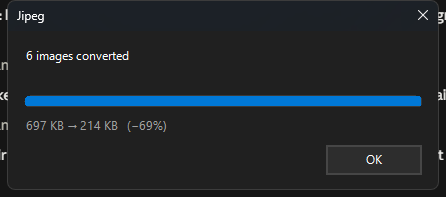
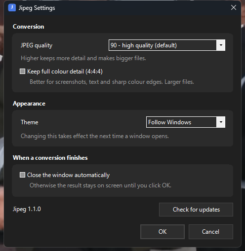

# Jipeg

Convert an image to JPEG from the **right-click menu**, using Google's
[jpegli](https://github.com/google/jpegli) encoder: same visual quality as an ordinary JPEG,
noticeably smaller file, and the result is still a plain `.jpg` that opens anywhere.

No application to launch and nothing to configure on the way: one context menu entry, a small
progress window in your Windows theme, done.



## Install

1. Download the repository (**Code → Download ZIP**) and unpack it.
2. Double-click **`Install.bat`**.
3. Click **Install**.

No administrator rights. Everything stays inside your user profile.

On Windows 11, leave the checkbox ticked: otherwise the entry only shows up under
**Show more options** (or Shift + F10). Ticking it restores the classic context menu and
restarts Explorer briefly.

## Use

Right-click an image → **Convert to JPEG (Jipeg)**.

- Works on a **multiple selection**: one window handles the whole batch.
- Right-click a **folder** to take every image inside it.
- The original is **never** modified or deleted. The result is written next to it with a
  `_jipeg` suffix (`photo.png` → `photo_jipeg.jpg`).
- The window shows progress, then the result (`697 KB → 214 KB (−69%)`) and waits for you
  to click **OK**. **Cancel** stops the batch after the current file.

## Settings

**Start menu → Jipeg Settings.** A small window, opened only when you want it:



| Setting | What it does |
|---|---|
| **JPEG quality** | libjpeg scale. 90 is the default; 78 is light enough for the web, 96 is close to lossless. |
| **Keep full colour detail (4:4:4)** | Disables chroma subsampling. Worth it for screenshots, text and sharp colour edges; files get larger. Pointless on photographs. |
| **Theme** | Follow Windows, or force Light or Dark. |
| **Close the window automatically** | Off by default, so the result stays until you dismiss it. |
| **Check for updates** | Asks GitHub whether a newer release exists and offers to open the download page. It never downloads or runs anything on its own. |

## Supported formats

PNG, APNG, JPEG, GIF, JXL, PPM/PNM/PGM/PAM/PFM directly;
BMP, TIFF and ICO through an automatic intermediate conversion.

WebP is not supported — `cjpegli` cannot read it.

## Worth knowing

- **Re-encoding an already compressed JPEG can make it bigger.** jpegli shines on
  uncompressed sources (PNG, TIFF) or high-quality JPEGs. When the result grows, the summary
  says so with a `+`: the number shown is always the real one.
- Metadata (EXIF, ICC profile) is not carried over by `cjpegli`.
- Files are encoded one at a time; the window stays responsive throughout.

## Uninstall

**`Uninstall.bat`**, or *Settings → Installed apps → Jipeg*.

Removes the context menu entry, the Start menu shortcut, the install folder and — only if the
installer turned it on — the classic context menu tweak. Converted images are left alone.

## Under the hood

| | |
|---|---|
| Installed in | `%LOCALAPPDATA%\Jipeg` |
| Registry keys | `HKCU\Software\Classes\SystemFileAssociations\<ext>\shell\JipegConvert` and `HKCU\Software\Classes\Directory\shell\JipegConvert` |
| Encoder | `cjpegli.exe` from **libjxl v0.11.1** — the last release to ship that binary (v0.12 dropped it, and `google/jpegli` publishes none) |
| Binary SHA-256 | `db564007b69b8f038eb4703fc72278c15a992aad9865fa59166735d6fd41b740` |
| UI | PowerShell 5.1 + WinForms, standard Windows controls, light/dark theme followed automatically |

The binary is committed so the ZIP is installable as-is. If it is missing, the installer
downloads the official libjxl v0.11.1 archive from GitHub and **verifies its SHA-256** before
extracting `cjpegli.exe`.

### Multiple selection

Explorer starts one process per selected file. The first one holds a lock for its whole life;
the others drop their paths into a shared queue and quit. The live instance picks them up,
including after the batch has finished (it resumes), and if something lands exactly as the
window closes it hands those files to a fresh instance instead of losing them.

### Why it looks the way it does

Every window uses real Windows controls, so it inherits the system font, the accent colour and
the rounded corners Windows 11 draws itself. Two things needed help: the native progress bar
has a white trough in dark mode, so the `DarkMode_Explorer` theme class is applied to it and a
panel behind supplies the track; and check boxes keep a white glyph whatever you set, so in
dark mode they are switched to `FlatStyle`. Acrylic and Mica backdrops were tried and dropped —
standard controls do not composite correctly on glass.

## Layout

```
Install.bat              runs the installer
Uninstall.bat            runs the uninstaller
bin/cjpegli.exe          the jpegli encoder (+ component licences)
src/Jipeg-Common.ps1     settings, theming and Win32 helpers
src/Jipeg-Convert.ps1    the converter and its progress window
src/Jipeg-Settings.ps1   the settings window
src/Install-Jipeg.ps1    installer (window, or -Silent for deployment)
src/Uninstall-Jipeg.ps1
src/launch.vbs           starts the converter without a console window
src/settings.vbs         starts the settings window without a console window
```

## Credits and licences

- The encoding is done by **[jpegli](https://github.com/google/jpegli)**, a Google project,
  shipped here as the `cjpegli.exe` binary built by
  **[libjxl](https://github.com/libjxl/libjxl)**. Jipeg is not affiliated with Google or the
  libjxl project and does not modify their code.
- Third-party licences: `bin/LICENSE.*` (BSD-3-Clause, Apache-2.0, zlib and others).
- Jipeg itself is MIT licensed — see [LICENSE](LICENSE).
